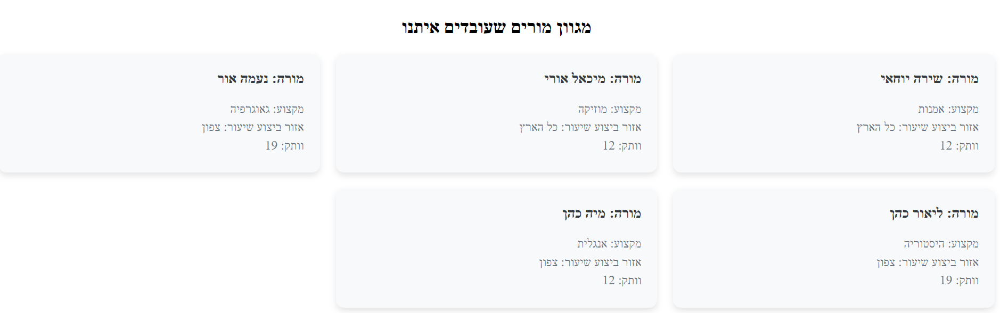

# TeachMe 

### group 42 part 3

### תיאור האתר 
האתר מספק פלטפורמה לתיאום שיעורים פרטיים עם מגון רחב של מורים במגוון רב של מקצועות. את השיעורים ניתן לערוך באופן מקוון בזום או באופן פרונטלי. כל תלמיד יכול להביע הערכה על שיעור שהתבצע בעזרת חוות דעת.
### העמודים שבחרנו להציג הינם
1. עמוד הבית לפני התחברות
2. המלצות ממשתמשים
3. כניסה למערכת
4. עמוד הבית לאחר התחברות
5. צפיה במגוון מורים שעובדים באתר
6. צפייה בהיסטורית השיעורים של אותו המשתמש
7. הבעת הערכה לשיעור שהמשתמש היה בו
8. התנתק מהמערכת

###
## העמודים:
1. ####     עמוד הבית לפני התחברות
בעמוד הבית לפני התחברות, מוצג לוגו החברה ותמונה הממחישה את עיקר מטרת החברה.
* ##### navigator before login
בעמוד הבית לפני התחברות ניתן להגיע למספר עמודים: עמוד הבית, כניסה למערכת והמלצות של משתמשים.

* ##### כניסה למערכת
בעמוד זה, המשתמש ינסה להיכנס למערכת בעזרת כתובת מייל וסיסמא אשר שמורים בבסיס הנתונים.
אם המשתמש לא קיים - הוא לא יוכל להשתמש באתר.

##### המלצות ממשתמשים
בעמוד זה ניתן לראות מספר של המלצות ממשתמשים קיימים ואת חוות הדעת שלהם.
מטרת עמוד זה, לגרום לאנשים להשתכנע כי האתר הוא אמין ויכול לעזור להם בלימודיהם.

##### דף הבית לאחר כניסה למערכת
בעמוד זה ניתן לראות מהן הפעולות שהמשתמש הקיים יכול לבצע.
המשתמש יכול לצפות במספר מורים שעובדים איתנו על מנת להתרשם מרצינות החברה.
בנוסף המשתמש יכול לצפות בהיסטורית השיעורים שלו.

##### navigator after login
כעת המשתמש יכול להתנתק מהמערכת.
בנוסף עמוד הבית כעת יהיה עמוד הבית לאחר התחברות.

##### עמוד צפייה במספר מורים שעובדים איתנו
בעמוד הזה ניתן לצפות במספר מורים שעובדים בחברה, ניתן לראות מה המקצוע אותו הם מלמדים, היכן ניתן לתאם איתם שיעור ומהו הוותק שלהם.

##### עמוד היסטוריית שיעורים
בעמוד זה, המשתמש שנכנס לאתר מזוהה וכעת כל השיעורים שהוא היה בהם מוצגים לפניו.
על כל שיעור שהוא היה בו הוא יכול להביע הערכה וללחוץ על כפתור הבע הערכה.

##### עמוד הבע הערכה
בעמוד זה, המשתמש יכול להביע הערכה בעבור שיעור שהיה בו.
הוא מזין הערכה במלל וגם מדרג מ1-10 את השיעור.
לאחר אישור הטופס, ההערכה נשמרת בבסיס הנתונים.

ראשית,התלמיד בוחר שיעור עליו ירצה להביע הערכה

לאחר מכן, מביע הערכה בעמוד הבא

##### איך להשתמש באתר
* יש להכנס לאתר עם כתובת מייל וסיסמא אשר כבר קימיים בבסיס הנתונים.
* ניתן להכנס עם המייל - avi@example.com 
* עם הסיסמא - 12345646
* לאחר הזדהות , ניתן לגשת לעמוד הבית ולבחור בפעולה המתאימה.
* אם ברצונכם לצפות בשיעורים שביצע אבי, ניתן ללחוץ על צפיה בהיסטורית שיעורים ולאחר מכן להביע הערכה.
#####  עמודים שלא השתמשנו בהם בחלק זה
השתמשנו בחלק מהעמודים לפי המתבקש מאיתנו.
העמודים שבחרנו שלא להציג הינם עמודים: הרשמה לאתר, תיאום שיעור, צור קשר, עדכון פרטי משתמש והצגה של השיעורים הבאים.

##### מגישים
טל לוי וגל רוזנברג